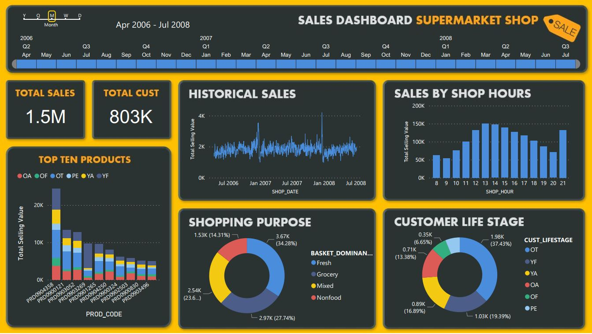
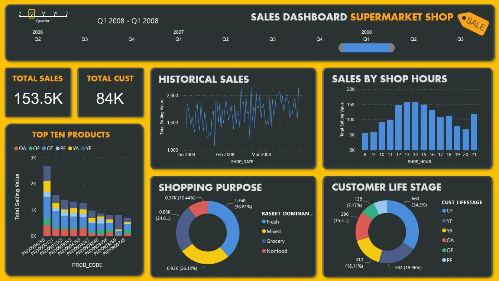

# CLV Dashboard
In this assignment, we generated one-page dashboard from supermarket sales data in 2016 - 2018. Top managements can easily see the important data and find support information quickly for their decision. The dashboard is also provided the timeframe slicer which help to select the focus timeframe (Overall, Quarterly, Monthly, Weekly, Daily) in a second. 

## Overall Dashboard

## Quarterly Dashboard

## Monthly Dashboard

