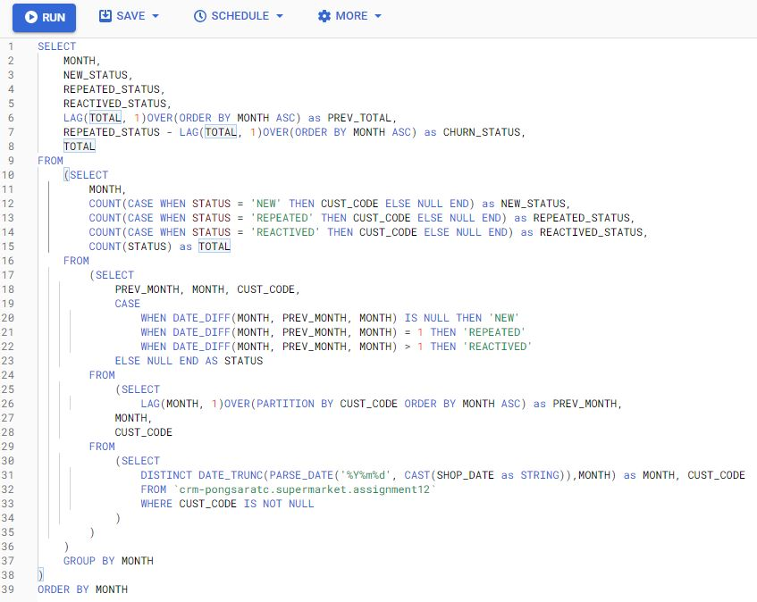
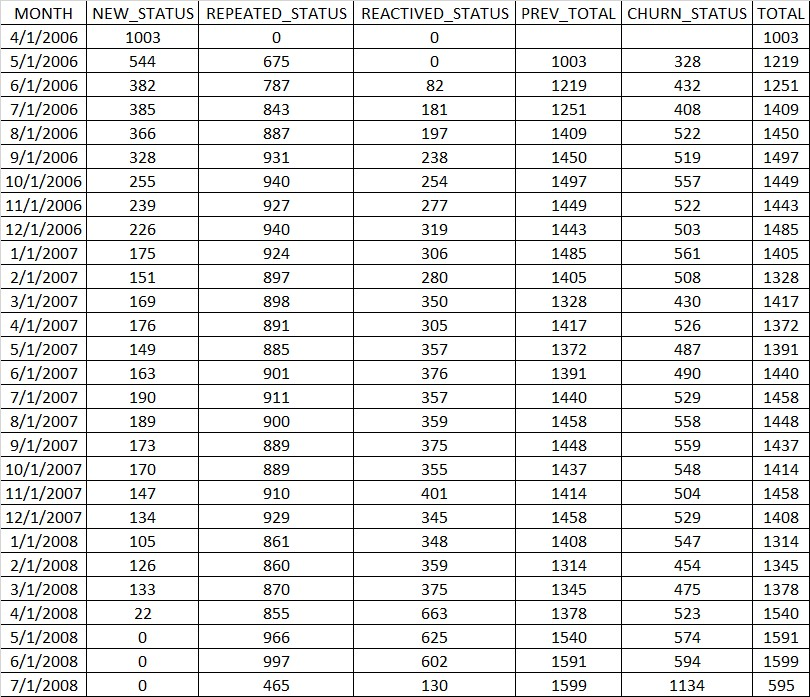
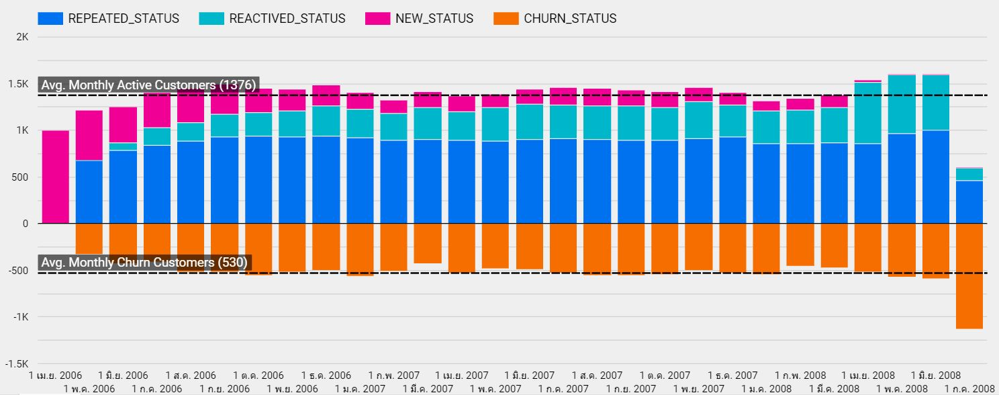

# Churn Analysis
In this assignment, we tried to perform Churn Analysis for customers from April 2006 to July 2018 by query via Google Bigquery.

## Query Command
The following command will help us to generate the summarized output for customers in each group.

## Output

## Visualization
Finally, we use the Google data studio to visualize the data as shown in below graph.

